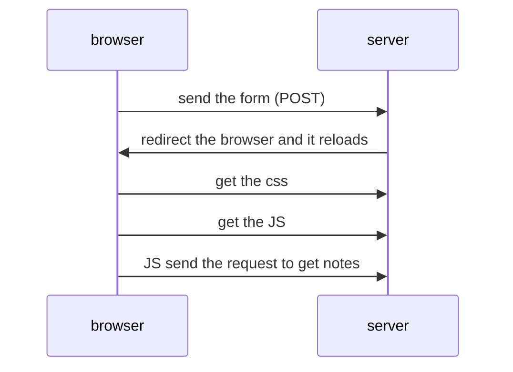

1. Send the form to serve
2. Server redirect the browser
3. browser get the css in the server
4. browser get the js in the server
5. js request the notes to serve

```mermaid 
sequenceDiagram
    browser->>server: send the form (POST)
    server->>browser: redirect the browser and it reloads
    browser->>server: get the css
    browser->>server: get the JS
    browser->>server: JS send the request to get notes
```